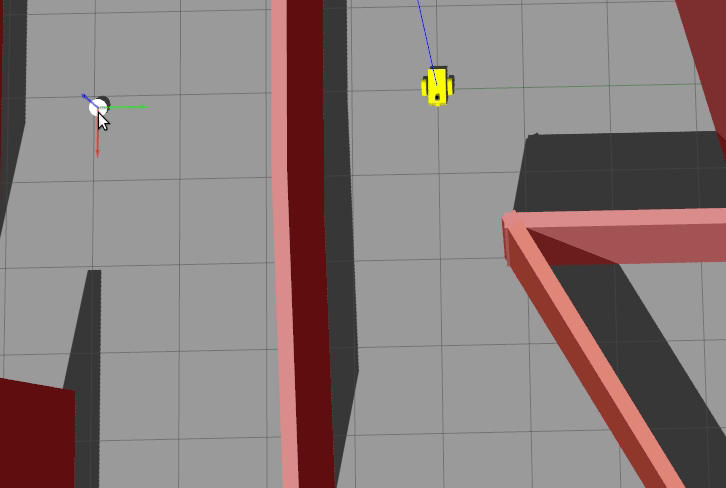
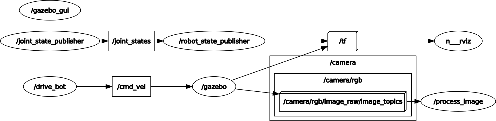

# Go Chase It
The aim of the project is to make robot follow while ball by using it's camera.

<p align="center">
  
  <br>Robot chasing the white ball
</p>

## Packages
* `my_robot`: Which includes robot model, sensor plugins and gazebo world.
* `ball_chaser`: Which includes image processer and robot driver nodes. 

## Nodes
* `process_image`: Which subscribes **/camera/rgb/image_raw** topic from camera and detects white blob on it. This node also calls **/ball_chaser/command_robot** service to steer robot.
* `drive_bot`: Which drives robot respect to **/ball_chaser/command_robot** service requests.

<p align="center">
  
  <br>Rosgraph of the project
</p>

## How to use
```bash
roslaunch my_robot world.launch
roslaunch ball_chaser ball_chaser.launch
rosrun rqt_image_view rqt_image_view
```


